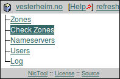
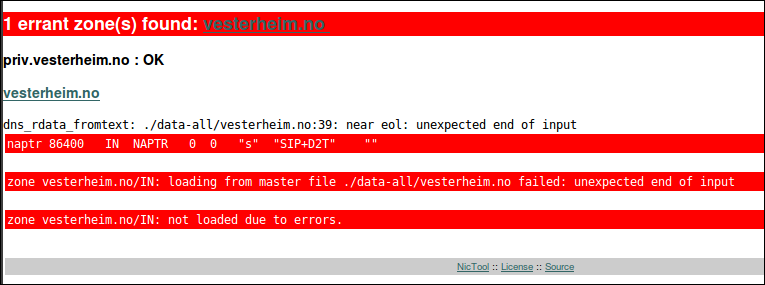
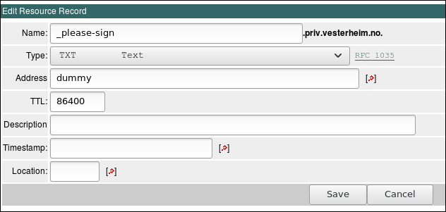

# Sentralisert redigering og publisering av DNS-data

-------------------------------

## Innledning

Som en tilleggstjeneste til
[hostmaster-tjenesten](https://www.uninett.no/domeneregistrering)
tilbyr Sikt også en sentralisert løsning for redigering av DNS-data
via et [web-grensesnitt](https://nictool.uninett.no). Grensesnittet er
basert på [Nictool](http://www.nictool.com/), med noen få lokale
tilpasninger. De registrerte dataene blir periodisk eksportert og
publisert via en lokal navnetjener som kjører på samme maskin som
web-frontenden. Denne vil opptre som såkalt skjult master for de
publiserende navnetjenerne. Endrede data vil derfra pushes ut til de
publiserende navnetjenerene. DNS-programvaren som benyttes til
publisering er [BIND](https://www.isc.org/downloads/bind/).

---

## Hvordan komme i gang

De som har fått hjelp av Sikt til å gjøre DNS-endringer, vil nå kunne
få mulighet til å gjøre endringer på egen hånd via det nye
webgrensesnittet. Ta kontakt med
[hostmaster@uninett.no](mailto:hostmaster@uninett.no) dersom dere er
interessert i dette.

Dokumentasjon til det nye grensesnittet finnes på
http://www.nictool.com/docs/client/.

---

## Forhåndsjekking av DNS-data

Den nye løsningen gjør en del konsistenssjekk av DNS-data før de
publiseres. Dersom konsistenssjekken feiler, vil ikke DNS-data bli
publisert. Denne sjekken baserer seg på bruk av programmet
[named-checkzone](http://www.manpagez.com/man/8/named-checkzone/).

Dette programmet har en rekke opsjoner som regulerer hva som skal
betraktes som feil. I vårt tilfelle kommer kjøringen til å se slik ut:

`named-checkzone -i full -k fail -m fail -M fail -n fail -S fail`

Vi har lagt inn en mulighet for at hver enkelt kan kjøre denne
forhåndsjekken direkte fra web-grensesnittet via menyvalget 'Check
Zones'. Det er derfor anbefalt at man kjører denne sjekken etter å ha
gjort endringer i grensesnittet.

Resultatet av kjøringen vises direkte i web-grensesnittet. Eventuelle
feil markeres med rødt.

I dette eksemplet har NAPTR-posten for få felt oppgitt;
'replacement' feltet er utelatt.  For definisjonen av NAPTR-posten se
forøvrig [RFC 2915](https://tools.ietf.org/html/rfc2915).

---

## Kjente feilmeldinger fra sonesjekk:

### <a name="CNAME_and_other_data">CNAME and other data</a>

Det er forsøkt registrere et alias med samme
navn som et eksisterende innslag, og det er ikke mulig.  CNAME betyr
"*alle* data for dette navnet finner du over der på det andre navnet".
En sone skal alltid ha en SOA-post og NS-poster registrert på selve
sonenavnet.  Det betyr at det ikke er mulig i tillegg å registrere en
CNAME-post på selve sonenavnet.  For web-tjenester som skal være nåbar
på selve sonenavnet må man følgelig registrere adresse-informasjonen
for web-serveren (via A og evt. AAAA) i stedet.

### <a name="is_a_CNAME_illegal">... is a CNAME ... (illegal)</a>

Flere posttyper inneholder pekere til andre navn der definisjonen for
posttypen sier at det navnet man peker på ikke er tillatt å være en
CNAME-post.  Eksempler her er MX og SRV: disse må peke på navn som har
enten A eller AAAA poster registrert direkte på seg.

---

## Registrering av revers-soner

Når man har fått tildelt en revers-sone med maske som er mindre enn
/24, så må soner og innhold registreres ihht
[RFC 2317](https://tools.ietf.org/html/rfc2317)

Eksempel:

Dersom man har fått tildelt adresse-rommet 158.36.100.128/25, så kan
man ikke registrere sonen 100.36.158.in-addr.arpa, fordi det betyr at
man "overtar" **hele** /24-adresserommet, når man bare har fått delegert
**en del av** adresserommet. Istedet skal man registrere
sonen 128.100.36.158.in-addr.arpa, og så kan man lage PTR-innslag i denne.

---

## DNSSEC

For å signalisere at en sone skal signeres med
[DNSSEC](https://en.wikipedia.org/wiki/Domain_Name_System_Security_Extensions),
så er det nødvendig å registrere en dummy TXT-record `_please-sign`, med vilkårlig
verdi, slik:

Dette vil plukkes opp av det bakenforliggende DNSSEC-maskineriet, som
vil sørge for at alle poster i sonen blir signert.  Det blir også
etterhvert generert en DS-post (Delegation Signer), denne må plasseres
i modersonen.

1. Merk at for soner som blir DNSSEC- signert, så blir MNAME-feltet i
SOA-posten overstyrt, det settes inn `ns.uninett.no` i dette
feltet.

1. Den ferdig DNSSEC-signerte sonen blir publisert med `ns.uninett.no`
   som master navnetjener, og det er derfor også naturlig å ha
   `ns.uninett.no` med i NS-settet for sonen.

1. Vi har automatisk provisjonering av slave-navnetjeneste på
   `nn.uninett.no` og `nac.no` for soner betjent av Nictool, inklusive
   DNSSEC-signerte soner, så disse kan dere fritt velge å føre opp i
   NS-settet for sonen.

1. For geografisk diversitet bør `nac.no` være med i NS-settet, da den
   er plassert i Oslo.  Resten av maskinene er lokalisert i Trondheim.

1. Dersom du ønsker å bruke andre slavenavnetjenere enn de som Sikt
   driver trenger du å slave sonen(e) deres fra `ns.uninett.no`.  Første
   gang dere tar en slik slave i bruk trenger dere å spørre oss om å
   åpne opp for soneoverføring fra den nye slaven.  Dersom dere har
   DNSSEC-signerte soner anbefales det sterkt å bruke TSIG for å sikre
   integriteten til soneoverføringen.

---

## Kontaktinformasjon

Spørsmål om Nictool kan rettes til [hostmaster@uninett.no](mailto:hostmaster@uninett.no)
