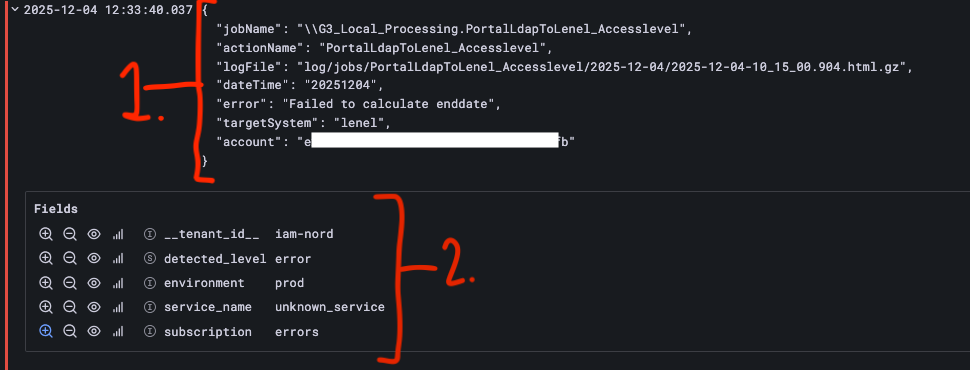

# Logger i Felles IAM

Logger for Felles IAMs tjenester er tilgjengelige for institusjonene på [https://logs.iam.sikt.no/](https://logs.iam.sikt.no/).

Tjenesten krever Feide-innlogging, og tilgang til tjenesten må bestilles fra Felles IAM. Dette må gjøres via din IAM-koordinator. Be de sende en epost til [kontakt@sikt.no](mailto:kontakt@sikt.no) med følgende informasjon:
 * Fullt navn
 * Feide-ID (Denne finner du på [https://innsyn.feide.no/aboutme](https://innsyn.feide.no/aboutme) under `Personopplysninger > Personlig ID hos vertsorganisasjonen`)

I grafana har hver institusjon sin egen organisasjon, og kan kun se sine egne logger. Per nå er det et subset av logger fra ActionSet i RapidIdentity som kommer hit, og de klassifiserer i én av to kategorier:
 * Error: feilmeldinger
 * Audit: endringsmelding på en bruker

## Hvordan søke i logger

Søking gjøres i `Explore` i sidebaren. Trykk der.

På denne siden er det noen felter du må ta stilling til før du vil se noen logger. Noen er påkrevd og noen har default-verdier som er

1. **Påkrevd**: Under `Label filter` trykk `Select label` og velg `Subscription`
2. **Påkrevd**: Under `Label filter` trykk `Select value` og velg enten `audit` eller `errors`, avhengig av hva slags meldinger du vil se
3. *Valgfri*: Tidsvindu. `Last 1 hour` (*den siste timen*) er default. Vil du se logger fra et annet tidsvindu så trykk på `Last 1 hour` og velg noe annet.
4. *Valgfri*: Når du åpner et nytt søk, som du akkurat har gjort her, så er filteret tomt. Det betyr at du vil se alle meldinger, ingen blir filtrert ut. Vil du filtrere på meldinger se dokumentasjonen for filtrering lenger nede.
5. Du kjører søket du har konfigurert opp ved å trykke den blå `Run query`-knappen. Loggene som matcher søket ditt vil dukke opp under søke-menyen, på bunnen av siden. Merk at blant annet knappene for tidsvinduvalg og `Run query` blir mindre etter du kjører det første søket. Men de fungerer fortsatt som før.

**Et notat om tunge søk**: Noe som er verdt å vite er at søk som gir en stor mengde logger, f.eks. om du søker over en stor periode uten tilstrekkelig filtrering, kan være veldig treige, eller til og med feile helt. Dette løses best ved å avgrense tidsrommet, men det finnes en del andre virkemidler. Grafana har noe dokumentasjon på denne problemstillingen [her](https://grafana.com/docs/loki/latest/query/bp-query/#query-best-practices).

**Et notat om generell Grafana-dokumentasjon**: Om du leser generell Grafana-dokumentasjon så er det verdt å vite at vårt oppsett bruker `Loki` som `data source`. Dokumentasjon som gjelder andre typer datakilder enn `Loki` kan derfor være mangelfull eller misvisende.

## Begrepsdefinisjoner man burde være klar over ifb. filtrering

Først noen begrepsdefinisjoner man burde få med seg om man skal filtrere på deler av en loggmelding.

En loggmelding består hovedsakelig av to deler:

1. Denne kaller vi `Line`, og den kan tenkes på som hoveddelen eller *kroppen* av meldingen. Litt uintuitivt, men hele JSON-objektet man ser her referes til som `line`. Når man filtrer med `Line contains` så sjekker man om hele dette objektet, som råtekst, inneholder tekst-strengen man søker etter.
2. Dette er `Fields`, og er hovedsakelig metadata om meldingen, og kan mer tenkes på som bakenforliggende felter som systemet bruker for å lagre dataen på riktig måte.

## Finne flere loggmeldinger som ligner på en du ser på

Et brukstilfelle Grafana støtter veldig godt er om du vil finne flere loggmeldinger som inneholder en del av informasjonen du ser på akkurat nå i en annen loggmelding. F.eks. om du ser på en melding med en spesifikk UHID og du vil finne alle feilmeldinger som inneholder den samme UHID-en.

