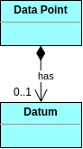

# KUDAF and Metadata standards

The KUDAF initiative relates to **two different Metadata standards**:

### [DCAT-AP-NO](https://data.norge.no/specification/dcat-ap-no) (Data Catalog Vocabulary)

This is the **Norwegian implementation** of the international [DCAT](https://www.w3.org/TR/vocab-dcat/) standard. At this level one can discover different data sources in the **[Felles datakatalog](https://data.norge.no/)**, for example.

Among the many different concepts included in this standard, **three important concepts are relevant to the Kudaf architecture**:

1. A **Catalog** [dcat:Catalog](https://www.w3.org/TR/vocab-dcat/#Class:Catalog) is defined as _"a curated collection of metadata about resources (e.g., datasets and data services in the context of a data catalog)"_.
2. A **Dataset** [dcat:Dataset](https://www.w3.org/TR/vocab-dcat/#Class:Dataset) is defined as _"a collection of data, published or curated by a single agent, and available for access or download in one or more representations"_. This is a broad definition, which could fit a database as well as a table within a database. But also a view on a database or the results of a query. And then is the matter of the representation: a dataset could be a JSON or CSV file containing data.
3. A **Data Service** [dcat:DataService](https://www.w3.org/TR/vocab-dcat/#Class:Data_Service) is defined as _"a collection of operations that provides access to one or more datasets or data processing functions"_. Here we can have, for example, an API.

   

### [RAIRD Information Model](https://statswiki.unece.org/display/gsim/RAIRD+Information+Model+RIM+v1_0)

A Norwegian implementation of the international [GSIM](https://statswiki.unece.org/display/gsim/GSIM+v1.2+Communication+Paper) (General Statistical Information Model) standard. Designed to address the need to **describe statistical information**, this framework _"provides a set of standardised, consistently described information objects, which can be used as inputs and outputs in the design and the production of statistics"_. It was created to facilitate making [Statistics Norway](https://www.ssb.no/en/data-til-forskning) data available for reserchers, for example through the [microdata.no](https://www.microdata.no/en/) portal and IDE.

**This level is where the Kudaf initiative concentrates**, because it enables the **description (through metadata) of all the data made publicly available**. The important concepts are:

1. **Variable**: Refers to **the _metadata_ describing a _minimalistic_ unit of data** that is useful for data analysis purposes. In order to make it _minimalistic_ and flexible for data analysis purposes we use a **datum-based data structure** (see description below).
2. **Unit identifier**: The unique identifier which singles out this unit of data.

#### Datum-based data structure

A **multi-variable source dataset**, such that is commonly available from a data source, would be structured as [GSIM Unit Data](https://statswiki.unece.org/display/gsim/RAIRD+Information+Model+RIM+v1_0#RAIRDInformationModelRIMv1_0-_Toc387424342):

| CASE_ID | DOB        | MAR_STAT | GENDER | DATE_MAR   | DATE_SEP | DATE_DIV |
| ------- | ---------- | -------- | ------ | ---------- | -------- | -------- |
| 0937    | 1971-05-03 | M        | 1      | 2003-08-04 | -        | -        |

This is the typical database structure that we know well, where the `CASE_ID` field is the **identifier** (primary key) field for the whole row. **The value found in a cell of that row would constitute a single [DATUM](https://statswiki.unece.org/display/clickablegsim/Datum)**, i.e. the value that populates a **Data Point**.

In order to provide maximum **flexibility** to the data researcher, we could **decompose this multi-variable dataset into stand-alone, SINGLE-VARIABLE DATASETS expressed in a _datum-based_ model**. For example, the above information on the Marital Status alone could be expressed as:

| IDENTIFIER | VAR_REF  | VALUE | START_DATE | END_DATE |
| ---------- | -------- | ----- | ---------- | -------- |
| 0937       | MAR_STAT | M     | 2003-08-04 | -        |

In fact we could model the entire multi-variable table from above according to the datum-based approach like this:

| IDENTIFIER | VAR_REF  | VALUE      | START_DATE | END_DATE |
| ---------- | -------- | ---------- | ---------- | -------- |
| 0937       | DOB      | 1971-05-03 | 1971-05-03 | -        |
| 0937       | MAR_STAT | M          | 2003-08-04 | -        |
| 0937       | GENDER   | 1          | 1971-05-03 | -        |

Each such **_datum_ constitures the _minimalistic unit of data_** we were refering to above.

And in order **to _describe_ the data contained within the _datum_ we define a Variable**. We use the siimple term Variable to refer thus to a Single-Variable Dataset.

**A [VARIABLE](https://statswiki.unece.org/display/clickablegsim/Variable) combines the meaning of a Concept with a Unit Type, to define the characteristic that is to be measured**.

Finally, the **metadata models for the Variable and for the Dataset are linked** as shown below:

---

