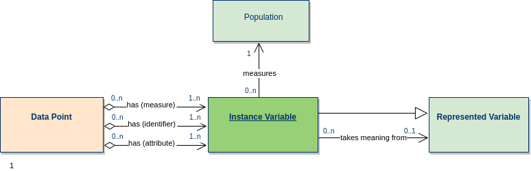
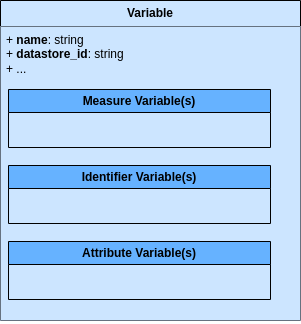

# Variables and Metadata

The **metadata elements describing a Variable** can be inferred from the (simplified) [Instance Variable conceptual model](https://statswiki.unece.org/display/clickablegsim/Instance+Variable) shown below:



We can then represent this using a Python schema as follows:

```python
class SingleVariableDataset:
    name: str
    datastore_id: str
    populationDescription: list[Description]
    subjectFields: list[str]
    temporalCoverage: ValidPeriod
    temporality: str
    spatialCoverageDescription: list[Description]
    sensitivityLevel: str
    updatedAt: datetime
    identifierVariables: list[IdentifierVariable]
    measureVariable: MeasureVariable
    attributeVariables: list[AttributeVariable]
```

Notice how the **three properties (measure, attribute, identifier) which describe the Data Point** in the model above are **represented in the schema by embedded data structures**.



They are of **three types**:

- **Measure Variables**: Metadata describing **WHAT is MEASURED** by this particular _datum_, **and HOW**.
- **Identifier Variables**: Metadata describing **WHAT uniquely IDENTIFIES** this particular _datum_, **and HOW**.
- **Attribute Variables**: Metadata describing **other attributes, especially TEMPORAL**, which are relevant about this particular _datum_.


## Variable naming guidelines

The name of a Variable should:

- Describe **what the _datum_ is measuring**
- Consist of a **single string in capital letters**, made up of **keywords separated by underscores** (`_`).
- In line with the Kudaf objective to maximize data-sharing potential, it would be preferrable to write the **keywords in English**.
- It **must be the same as the name of the Measure Variable** data structure within the Variable.
- The name **must be UNIQUE within** the set of Variables from a given **data source**.

**How to choose the keywords** in the Variable's name:

- The **1st keyword** (before the first underscore) in the name indicates the **data source**. Examples:
    - Feide public API: "FEIDEAPI"
    - Feide Statistics database: "FEIDESTATS"
    - Lånekasen: "LK"
- The **2nd keyword (or group of keywords)** should summarize **what the variable is measuring**. Examples:
    - School names: "SCHOOL_NAMES" (in this case not technically a "measure", more of a qualifier)
    - Login event counts: "LOGINS"
    - Multi-factor authentication event counts: "MFAS"
- The **3rd keyword (or group of keywords)** should point out the **unique identifier(s)** of the Variable. Examples:
    - If the login event counts are accumulated for each organization: "ORG"
    - If the multi-factor authentication event counts are accumulated for each combination of organization and authentication method: "ORG_METHOD"
- The **last keyword (if present)** can indicate the variable's **temporality**:
    -  If the temporality type is **"FIXED", we can omit it.**
    - **Otherwise** for the other temporality types, **choose one of: "ACCUM", "STATUS", "EVENT"**.

A complete example from the above could be "FEIDESTATS_LOGINS_ORG_SP_ACCUM". This Variable would thus refer to data that:

- Comes from the Feide Statistics data source.
- Measures login event counts.
- Each measure is identified by an organization and a service provicder.
- The measures (login event counts) are accumulated over a given time period.
