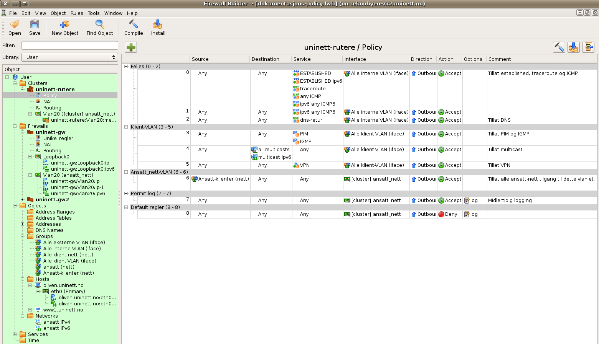

## Innledning

Lange og komplekse pakkefilter, redundante rutere og introduksjon av
IPv6 har gjort at det er nødvendig å se på alternative måter å lage
pakkefilter på. Firewall builder (fwbuilder) er installert på
verktøykassene, og kan brukes til å håndtere blant annet Cisco
aksesslister. Denne dokumentasjonen er skrevet basert på hvordan UNINETT
har tatt ibruk fwbuilder lokalt hos seg. Fremgangsmåten som brukes og
løsningene man kommer frem til kan selvfølgelig være helt forskjellig
ifra det vi har gjort. Denne dokumentasjonen er altså ment som tips til
hvordan man kommer igang, og enkelte ting man bør være obs på. For mer
informasjon om Firewall builder, se [fwbuilder sine
hjemmesider.](http://www.fwbuilder.org/)

Fremgangsmåten for å etablere filter via firewall builder er lik måten
man gjør det med "manuelle filter", og her er tips til hvordan det
gjøres: [UFS 106](https://ow.feide.no/_media/gigacampus:ufs:ufs_106.pdf)

## Komme igang med programmet, og få filer inn i RCS

-   Logg inn på verktøykassen med din ssh-klient. Husk at X11-forwarding
    må være påslått.
-   Programmet startes med `fwbuilder`
-   Opprett en firewall eller gjør noe småtteri som gjør at du kan lagre
    det du har gjort som ei fil.
-   Lagre fila under vk:`/tftpboot/`
-   Gå ut av programmet
-   Fra terminalvinduet stående i tftpboot, sjekk inn den nye fila med
    `ci -u 'filnavn'`, og skriv inn en kommentar
-   Neste gang starter du nå programmet med `fwbuilder 'filnavn'`. Når du
    nå kommer inn i firewall builder vil du få oversikt over alle
    tidligere revisjoner, og kommentarene som er skrevet inn for hvilke
    endringer som er gjort
-   Du vil heretter få spørsmål om å sjekke inn fila og kommentere hva
    du har gjort når du forlater programmet

## Definere ruter(e)

-   Opprett ruter (heretter kalt firewall, som også brukes i GUI)
-   Vi anbefaler å ikke bruke snmp til å hente inn informasjon om
    interfacer. Grunnen til det er at man sannsynligvis ønsker å legge
    over filter fra ett interface i gangen. Da er det beste å gjøre
    dette kontrollert en av gangen, slik at ikke man ødelegger gamle
    lister på interfacer man ikke er klar til å legge over i første
    omgang.
-   Opprett ett interface på firewall. Vi starter med Loopback0 som er
    management-interface. Merk dette med management og unprotected. Legg
    inn adresser på interfacet. Det er denne adressen som blir brukt når
    programmet skal legge over filterne til ruteren.
-   Man må velge om policy'en for ruteren skal være bare IPv4 eller både
    IPv4 og IPv6. Dette gjør du ved å dobbeltklikke på *Policy* under
    ruteren, og velger *Rule set*.

## Lage filter for et gitt interface

-   Lag ett nytt interface. Navngi dette til det interfacet som du skal
    lage pakkefilter for. Legg til adressene til interfacet. Både IPv4
    og IPv6.
-   Dette interfacet er nå klart til å bruke i regler i policy'n
-   Dersom du har redundant ruteroppsett (f.eks VRRP), definerer du
    begge ruterne, og lager cluster-interface. Under dette
    cluster-interfacet lager du en ny failover-group der interface fra
    begge rutere er medlemmer. Når du nå bruker dette cluster-interfacet
    i regelsettet vil programmet sørge for at policy'n blir lagt inn på
    begge ruterne.
-   Opprett en ny regel i policy'n. Du kan nå dra interfacet du laget
    over i interface-kolonnen.
-   Lag deg host, nett, tjeneste oa. objekt etterhvert som du trenger
    dem. Disse kan nå draes over i policy'n. Husk å lag både IPv4 og
    IPv6 adresser.
-   Programmet har ett sett med standard-bibliotek som er kjekt for
    "kjente" tjenester. Disse finner du om du velger Library Standard
    istedet for Library User.

## Gruppere interface

-   Dersom du skal lage regler som er lik for flere interface er det
    kjekt å gruppere disse i objekter. Slik kan du bruke dette objektet
    i reglene istedet. Prøv å tenk igjennom slike grupperinger på
    forhånd. Under omlegging så sørg for å legge til nye interface inn i
    disse objektene etterhvert som du oppretter dem i firewall builder.
-   Vi har f.eks laget ei gruppe som inneholder alle interne VLAN. Ved å
    bruke dette objektet i reglene vil alle VLAN (som er medlem i
    objektet) få disse samme reglene. (se eksempel nedenfor)
-   Det samme kan f.eks brukes for felles regler for alle vlan med
    klienter. (se eksempel nedenfor)
-   Regler kan grupperes slik at det blir mer oversiktlig. Vi har valgt
    å først gruppere regler som gjelder alle VLAN. Deretter alle klient
    VLAN. Deretter grupperer vi regler som gjelder hvert enkelt vlan.
    Nest sist har vi en gruppering der vi lager midlertidige regler med
    logging som vi bruker når vi utarbeider filtrene. Til slutt har vi
    en gruppering der vi for hvert enkelt VLAN har en regel som sørger
    for å "stenge enden" for ett gitt filter.

## Eksempel på oppsett

Her er ett eksempel der vi har opprettet to rutere (uninett-gw og
uninett-gw2), der begge har vlan20. Vi har laget ett cluster mellom
disse to, og det er dette cluster-interfacet vi bruker i policyen til
høyre. Har man kun èn ruter er ikke dette nødvendig. Først har vi
felles-regler som vil gjelde alle vlan-interface som blir lagt til i
"Alle interne VLAN". Så har vi regler som vil gjelde alle
klient-interface som blir lagt til i "Alle klient-VLAN". Deretter kommer
spesifikke regler for Vlan 20.



## Legge over filter til ruteren

-   Når du er klar til å legge over reglene velger du install. Her vil
    den først kompilere reglene for deg.
-   Velg inspect generated files. Slik kan du gå inn å kontrollere hva
    som faktisk blir lagt over til ruteren i form av pakkefilter-regler.
-   Dersom alt ser fint ut trykk next, og du vil få opp ett
    innloggingsvindu mot ruteren. Her kan du etterhvert følge med mens
    ruteren jobber med å legge over filtrene. Du kan også velge dry run
    om du bare vil teste å legge over reglene til ruteren.

## Tips og triks

-   Prøv ut prosessen på ett test-vlan i første omgang for å gjøre deg
    kjent med hvordan ting fungerer

-   Under menyen `Edit -> Preferences -> Objects -> Policy
    rules`, velg *Create new policy rules with direction Outbound*, slik at
    du slipper å endre den for nye regler du legger inn. Det samme kan
    du gjøre for *Create new policy rules with action Accept*. Her er det
    også mulig å velge default dummy objekt for src, dst, service og
    interface. Dette kan være kjekt for å unngå at man glemmer å legge
    inn ett objekt på en av disse. Ved å høyreklikke på dummy-objektet
    får du opp en meny der du kan velge å endre til `any`.

-   Det er mulig å endre bakgrunnsfarge på reglene i regelsettet. Dette
    kan være kjekt for å for eksempel merke regler som er midlertidig,
    eller som må sjekkes nærmere.

-   Du kan kopiere objekt som allerede er brukt på høyresiden i
    regelsettet også. Hold inn ctrl mens du peker på ett objekt, og dra
    dit du vil kopiere til. Slik slipper du å finne igjen objekter du
    bruker ofte på venstre-siden hele tiden.

-   Kommenter reglene dine slik at du finner ting igjen i selve reglene.

-   Du kan søke på port og ip i søkefeltet ved å skrive ip: eller port:.
    Ved søking etter IP-adresse vil gi den finne alle objekter som
    omfatter denne IP-adressen, også større nettblokker hvor IP-adressen
    er en av flere.

-   Du kan låse av objekter som du ikke vil at noen skal endre på ved
    ett uhell. Høyreklikk på objektet og velg lock. Låsen fjernes igjen
    ved samme operasjon. Men da er det ett bevist valg å gjøre endringer
    der iallefall. Veldig kjekt å gjøre for interface f.eks som sjelden
    endres. Men følgene ved at noen gjør feil ting der kan være
    kritiske.

-   Siden grupper av objekter følger flat struktur ift. mapper har vi
    navngitt alle grupper med suffix:
    -   (iface) for grupper av interface-objekter
    -   (nett) for grupper av nettverks-objekter
    -   (hosts) for grupper av host-objekter

-   Etter kompilering får man opp en knapp der man kan se diff av de
    gamle og nye listene. For at dette skal virke må det under menyen
    `Edit -> Preferences -> Diff`, være krysset av for *"Enable
    autocompiling when loading file"*. Vi bruker `meld` som diff-viewer, og
    stien til den må også være angitt der. For å unngå at `meld` viser
    alle kommentarer som eventuelt har endret seg i koden din, så er det
    lurt å legge inn ett filter som overser kommentarene. I menyen til
    `meld`, `Edit -> Preferences -> Text Filters`, legg inn en ny
    regel som som ser slik ut `^! Rule.\*` (Uten semikolon).

-   For å sikre at vi får *write mem* + *write net* etter at filter er lagt
    over editerer vi for hver ruter *"Firewall Settings…"* *Prolog/Epilog*
    og legger til følgende i epilogen:

    ```
    exit
    write memory
    tclsh
    exec copy running-config tftp://trane.uninett.no/uninett-gw-confg
    exit
    ```

-   Husk å fjerne de gamle filtrene fra ruteren, og evt. fra tftpboot på
    verktøykassen i etterkant. Da slipper du forvirring på hvilken liste
    som faktisk er i drift.

## Kontaktpersoner

- rune.sydskjor@sikt.no
- morten.knutsen@sikt.no
